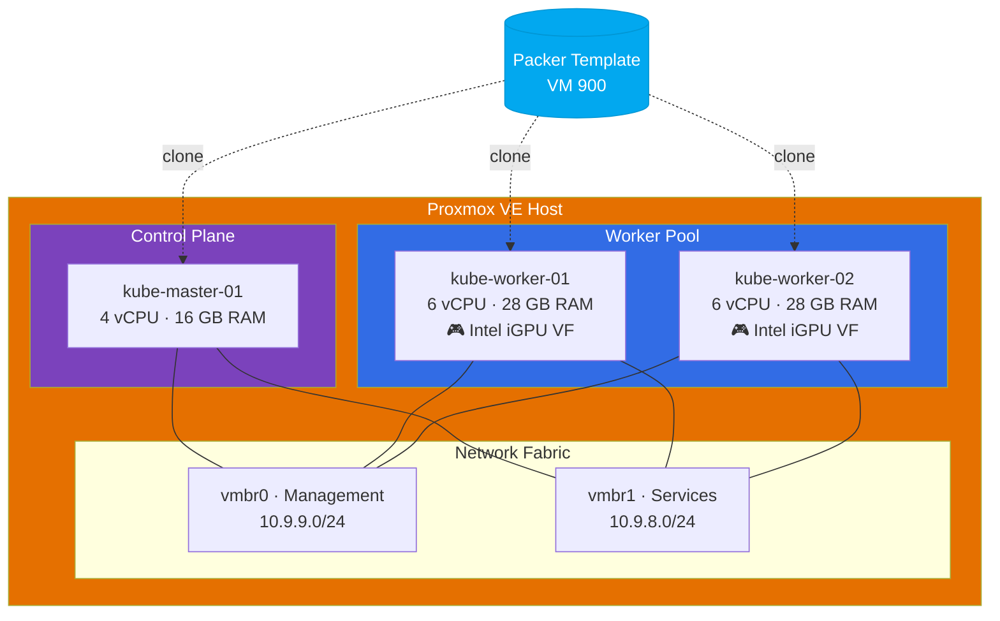
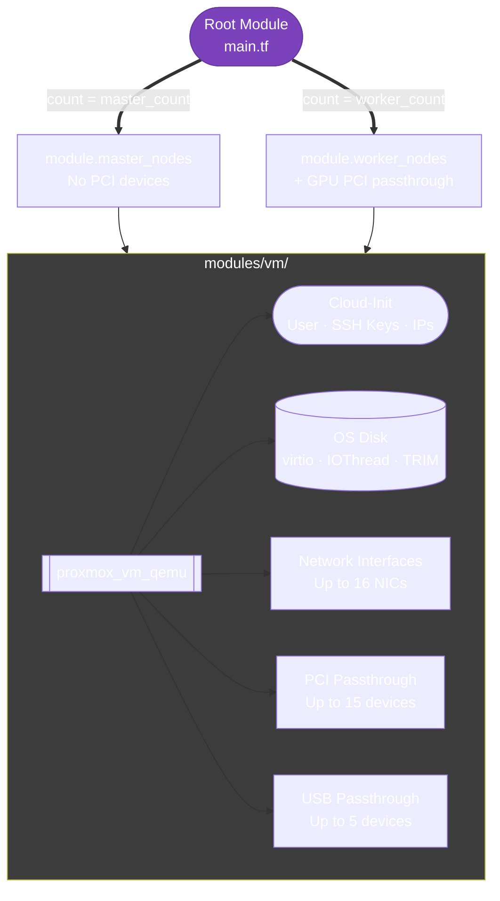
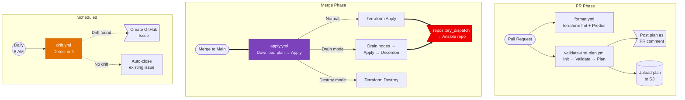

<div align="center">

# 🏗️ Terraform — Cluster Provisioning

**Declarative Proxmox VM provisioning for a K3s Kubernetes cluster**

[](https://www.terraform.io/)
[](https://www.proxmox.com/)
[](#)

*Transforms Packer-built golden images into a fully networked, GPU-enabled Kubernetes cluster*

</div>

---

## Table of Contents

- [Overview](#overview)
- [Cluster Architecture](#cluster-architecture)
- [Network Design](#network-design)
- [VM Module](#vm-module)
- [Packer Integration](#packer-integration)
- [State Management](#state-management)
- [CI/CD Automation](#cicd-automation)
- [Prerequisites](#prerequisites)
- [Usage](#usage)
- [License \& Contributing](#license--contributing)

---

## Overview

This repository provisions the compute layer of a Kubernetes homelab — cloning Packer-built Debian templates into statically-addressed, GPU-enabled VMs on Proxmox VE. It manages:

- **Master and worker node pools** with independent sizing
- **Dual-NIC networking** across management and services VLANs
- **Intel GPU passthrough** via PCI device mappings on worker nodes
- **Cloud-init injection** for SSH keys, static IPs, and DNS configuration

The template name is driven by `packer-manifest.json`, which is automatically updated via PR from the Packer build pipeline — creating a seamless image-to-cluster flow.

---

## Cluster Architecture


```mermaid
flowchart TB
    subgraph proxmox["Proxmox VE Host"]
        subgraph master["Control Plane"]
            M1["kube-master-01\n4 vCPU · 16 GB RAM"]
        end

        subgraph workers["Worker Pool"]
            W1["kube-worker-01\n6 vCPU · 28 GB RAM\n🎮 Intel iGPU VF"]
            W2["kube-worker-02\n6 vCPU · 28 GB RAM\n🎮 Intel iGPU VF"]
        end

        subgraph networks["Network Fabric"]
            MGMT["vmbr0 · Management\n10.9.9.0/24"]
            SVC["vmbr1 · Services\n10.9.8.0/24"]
        end
    end

    M1 --- MGMT
    M1 --- SVC
    W1 --- MGMT
    W1 --- SVC
    W2 --- MGMT
    W2 --- SVC

    TEMPLATE[(Packer Template\nVM 900)] -.->|clone| M1
    TEMPLATE -.->|clone| W1
    TEMPLATE -.->|clone| W2

    style proxmox fill:#E57000,color:#fff
    style master fill:#7B42BC,color:#fff
    style workers fill:#326CE5,color:#fff
    classDef tmpl fill:#02A8EF,stroke:#0196D4,color:#fff
    class TEMPLATE tmpl
```

All VMs are cloned from the same immutable Packer template, then individualized via cloud-init (hostname, static IPs, SSH keys). Worker nodes additionally receive **Intel iGPU virtual functions** via PCI passthrough for hardware-accelerated transcoding and ML workloads.

---

## Network Design

Every node is dual-homed across two isolated networks:

| Network | Bridge | CIDR | Gateway | Purpose |
|---------|--------|------|---------|---------|
| **Management** | `vmbr0` | `10.9.9.0/24` | `10.9.9.1` | SSH, Kubernetes API, Kube-VIP HA |
| **Services** | `vmbr1` | `10.9.8.0/24` | — | Pod overlay (Flannel), NFS, LoadBalancer traffic |

IP addresses are computed deterministically from a base CIDR and offset:

| Node | Management IP | Services IP | VM ID |
|------|--------------|-------------|-------|
| kube-master-01 | `10.9.9.50` | `10.9.8.50` | 200 |
| kube-worker-01 | `10.9.9.51` | `10.9.8.51` | 201 |
| kube-worker-02 | `10.9.9.52` | `10.9.8.52` | 202 |

> IPs are calculated as `base_cidr + start_offset + node_index`, ensuring masters and workers form a contiguous block.

---

## VM Module

A reusable Terraform module (`modules/vm/`) encapsulates all VM provisioning logic:


```mermaid
flowchart TB
    ROOT(["Root Module\nmain.tf"])

    ROOT ==>|"count = master_count"| MASTER["module.master_nodes\nNo PCI devices"]
    ROOT ==>|"count = worker_count"| WORKER["module.worker_nodes\n+ GPU PCI passthrough"]

    subgraph mod["modules/vm/"]
        VM[[proxmox_vm_qemu]]
        VM --> CI([Cloud-Init\nUser · SSH Keys · IPs])
        VM --> DISK[(OS Disk\nvirtio · IOThread · TRIM)]
        VM --> NET["Network Interfaces\nUp to 16 NICs"]
        VM --> PCI["PCI Passthrough\nUp to 15 devices"]
        VM --> USB["USB Passthrough\nUp to 5 devices"]
    end

    MASTER --> mod
    WORKER --> mod

    classDef root fill:#7B42BC,stroke:#6A35A3,color:#fff
    style mod fill:#3C3C3C,color:#fff
    class ROOT root
```

The module supports:

| Feature | Details |
|---------|---------|
| **Multi-NIC** | Dynamic network interface generation (up to 16) with per-NIC IP config |
| **PCI Passthrough** | GPU, network cards, or any PCI device via Proxmox resource mappings |
| **USB Passthrough** | Direct USB device access for IoT/serial hardware |
| **Cloud-Init** | User provisioning, SSH keys, static IP assignment, DNS config |
| **Storage** | Virtio disks with IOThread, TRIM/discard, configurable pools |
| **Tagging** | Proxmox tags for Ansible dynamic inventory discovery |

---

## Packer Integration

The `packer-manifest.json` file is the bridge between the Packer and Terraform repos:

```json
{
  "builds": [{
    "custom_data": {
      "vm_name": "packer-debian-13.4.0-...",
      "git_tag": "v13.4.0...",
      "i915_sriov_version": "..."
    }
  }]
}
```

This file is **automatically updated via PR** from the Packer build workflow. The `vm_name` field becomes the `base_vm_name` variable — the template that Terraform clones for all cluster nodes.


```mermaid
flowchart LR
    PK(["📦 Packer Build"]) ==>|"Creates PR with\npacker-manifest.json"| PR{{"Pull Request\n+ Review"}}
    PR ==>|Merge| TF(["🏗️ Terraform Plan"])
    TF ==>|"Clone template"| VMs[(VMs 200–202)]

    classDef packer fill:#02A8EF,stroke:#0196D4,color:#fff
    classDef terraform fill:#7B42BC,stroke:#6A35A3,color:#fff
    class PK packer
    class TF terraform
```

---

## State Management

Terraform state is stored in an **S3-compatible backend**, keeping state off local machines and enabling CI-driven workflows:

| Setting | Value |
|---------|-------|
| **Backend** | S3-compatible (path-style) |
| **Bucket** | `terraform-state` |
| **Key** | `terraform.tfstate` |
| **Locking** | Implicit via CI (single runner) |

---

## CI/CD Automation

Four workflows manage the full infrastructure lifecycle:


```mermaid
flowchart TD
    subgraph pr["PR Phase"]
        PR([Pull Request]) --> FMT[format.yml\nterraform fmt + Prettier]
        PR --> VP[validate-and-plan.yml\nInit → Validate → Plan]
        VP --> CMT>Post plan as\nPR comment]
        VP --> S3[(Upload plan\nto S3)]
    end

    subgraph merge["Merge Phase"]
        MERGE([Merge to Main]) ==> APP[apply.yml\nDownload plan → Apply]
        APP -->|Normal| APPLY[Terraform Apply]
        APP -->|Drain mode| DRAIN[Drain nodes →\nApply → Uncordon]
        APP -->|Destroy mode| DESTROY[Terraform Destroy]
        APPLY & DRAIN ==> DISPATCH>repository_dispatch\n→ Ansible repo]
    end

    subgraph sched["Scheduled"]
        DAILY((Daily\n8 AM)) --> DRIFT[drift.yml\nDetect drift]
        DRIFT -.->|Drift found| ISSUE>Create GitHub\nIssue]
        DRIFT -.->|No drift| CLOSE["Auto-close\nexisting issue"]
    end

    classDef apply fill:#7B42BC,stroke:#6A35A3,color:#fff
    classDef dispatch fill:#EE0000,stroke:#CC0000,color:#fff
    classDef drift fill:#E57000,stroke:#CC6300,color:#fff
    class APP apply
    class DISPATCH dispatch
    class DRIFT drift
```

| Workflow | Trigger | Purpose |
|----------|---------|---------|
| **validate-and-plan** | PR | Terraform init/validate/plan with PR comment preview |
| **format** | PR | Enforces `terraform fmt` and Prettier formatting |
| **apply** | Merge to main | Applies plan with optional drain/destroy modes via PR checkboxes |
| **drift** | Daily at 08:00 UTC | Detects infrastructure drift, creates/closes GitHub issues |

### Operational Modes

The apply workflow supports three mutually exclusive modes, controlled via checkboxes in the PR template:

| Mode | Behavior |
|------|----------|
| **Normal** | Standard `terraform apply` |
| **Drain** | Cordon + drain cluster nodes → apply → uncordon + wait for readiness |
| **Destroy** | Full `terraform destroy` (requires explicit checkbox confirmation) |

After a successful apply, the workflow **triggers the Ansible repo** via `repository_dispatch`, continuing the pipeline.

---

## Prerequisites

- **Proxmox VE** with API token access
- **S3-compatible storage** for Terraform state (e.g., MinIO)
- **Packer template** built and available on the Proxmox node
- **Terraform** ≥ 1.5.0
- **telmate/proxmox** provider

---

## Usage

```bash
# Initialize providers and backend
terraform init

# Preview changes
terraform plan

# Apply infrastructure
terraform apply
```

> In practice, all operations run via CI. The `validate-and-plan` workflow posts a plan preview on every PR, and `apply` runs automatically on merge.

---

## License & Contributing

This is a personal homelab project. Feel free to use it as inspiration for your own infrastructure. If you spot an issue or have a suggestion, [open an issue](../../issues) — contributions and feedback are welcome.
