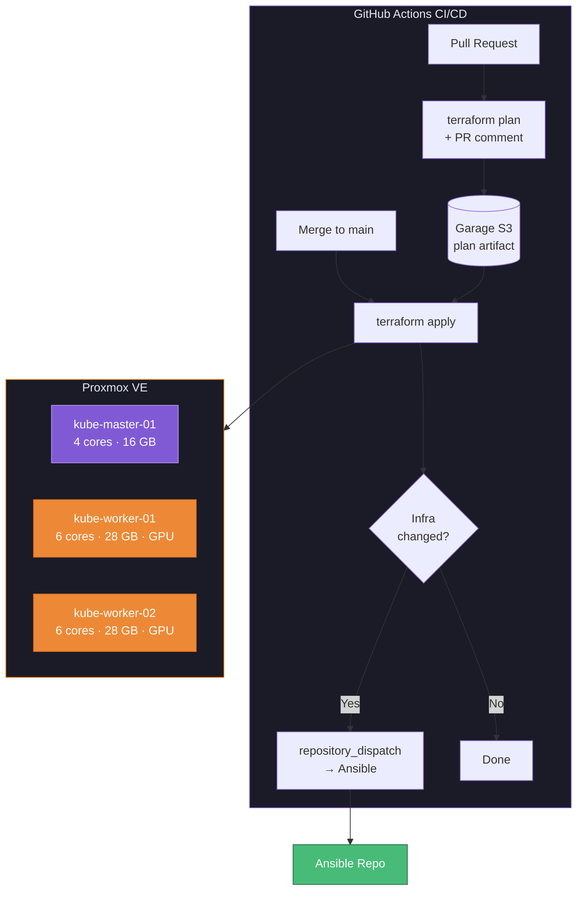
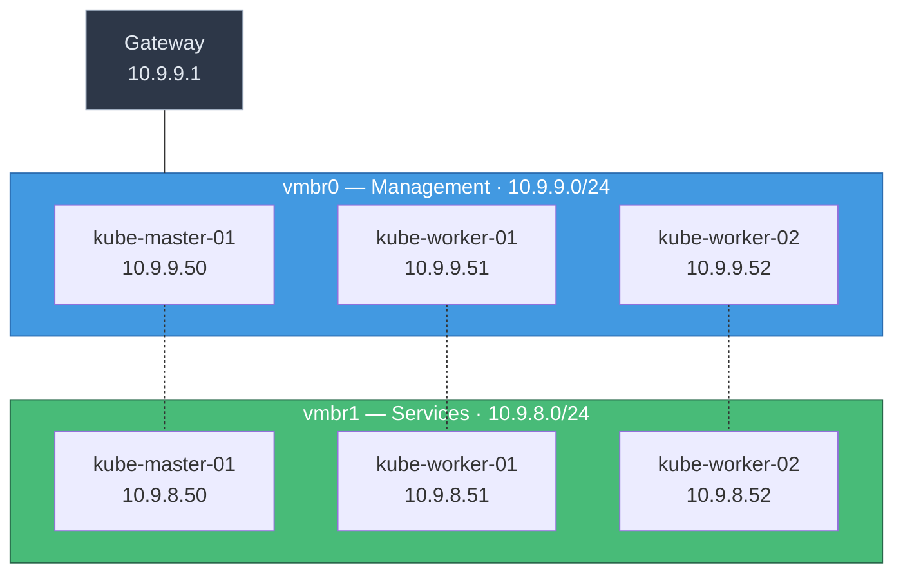
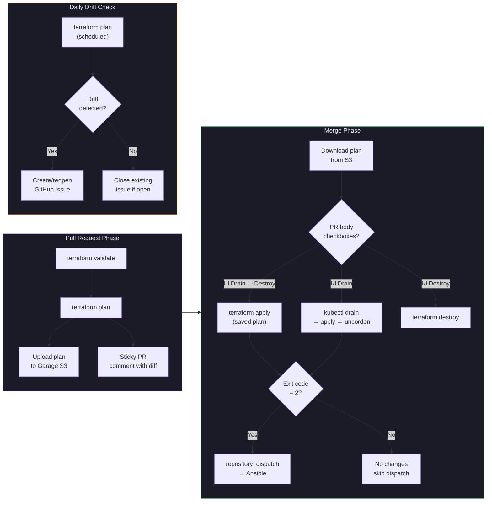
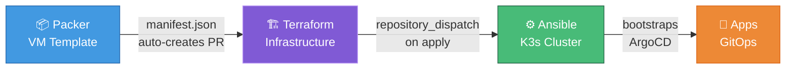

# Homelab Terraform

[](https://github.com/Starktastic-Homelab/terraform/actions/workflows/validate-and-plan.yml)
[](https://github.com/Starktastic-Homelab/terraform/actions/workflows/apply.yml)
[](https://github.com/Starktastic-Homelab/terraform/actions/workflows/drift.yml)


Terraform configuration for provisioning a K3s Kubernetes cluster on Proxmox VE — dual-NIC networking, Intel SR-IOV GPU passthrough for workers, and a fully GitOps CI/CD pipeline with drift detection, drain/destroy safety modes, and S3-backed plan artifacts.

## Overview

This is the second stage of the [Starktastic Homelab](https://github.com/Starktastic-Homelab) pipeline. It clones the VM template built by [Packer](https://github.com/Starktastic-Homelab/packer) into a fleet of Kubernetes-ready VMs on Proxmox VE, then triggers [Ansible](https://github.com/Starktastic-Homelab/ansible) to install K3s via repository dispatch.


```mermaid
flowchart TB
    subgraph ci["GitHub Actions CI/CD"]
        direction TB
        PR["Pull Request"] --> Plan["terraform plan\n+ PR comment"]
        Plan --> S3[("Garage S3\nplan artifact")]
        Merge["Merge to main"] --> Apply["terraform apply"]
        S3 --> Apply
        Apply --> Check{"Infra\nchanged?"}
        Check -- "Yes" --> Dispatch["repository_dispatch\n→ Ansible"]
        Check -- "No" --> Done["Done"]
    end

    subgraph proxmox["Proxmox VE"]
        Master["kube-master-01\n4 cores · 16 GB"]
        W1["kube-worker-01\n6 cores · 28 GB · GPU"]
        W2["kube-worker-02\n6 cores · 28 GB · GPU"]
    end

    Apply --> proxmox
    Dispatch --> Ansible["Ansible Repo"]

    style ci fill:#1a1b27,stroke:#805ad5,color:#e2e8f0
    style proxmox fill:#1a1b27,stroke:#e57000,color:#e2e8f0
    style Master fill:#805ad5,stroke:#b794f4,color:#fff
    style W1 fill:#ed8936,stroke:#dd6b20,color:#fff
    style W2 fill:#ed8936,stroke:#dd6b20,color:#fff
    style Ansible fill:#48bb78,stroke:#276749,color:#fff
```

## Features

- **GitOps Pipeline** — Plan on PR with sticky comment, apply on merge, smart skip detection
- **Packer Integration** — `packer-manifest.json` auto-updated via cross-repo PR from Packer builds
- **Dual-NIC Networking** — Management network (`vmbr0`) + services network (`vmbr1`) per VM
- **GPU Passthrough** — Intel SR-IOV PCI mapping (`k3s-worker-gpus`) attached to every worker
- **Drift Detection** — Daily scheduled plan with auto-created GitHub issues when drift is found
- **Drain & Destroy Modes** — PR body checkboxes enable safe node draining or full teardown
- **S3 State & Plans** — Terraform state and per-PR plan artifacts stored in self-hosted Garage
- **Smart Dispatch** — Only triggers Ansible when `terraform apply` actually changes infrastructure

## Architecture

### Cluster Topology

| Node | Role | Cores | RAM | GPU | Disk | Management IP | Services IP |
|------|------|-------|-----|-----|------|---------------|-------------|
| **kube-master-01** | Control Plane | 4 | 16 GB | — | 96 GB | `10.9.9.50` | `10.9.8.50` |
| **kube-worker-01** | Worker | 6 | 28 GB | ✅ SR-IOV | 96 GB | `10.9.9.51` | `10.9.8.51` |
| **kube-worker-02** | Worker | 6 | 28 GB | ✅ SR-IOV | 96 GB | `10.9.9.52` | `10.9.8.52` |

### Network Architecture

Every VM gets two virtual NICs — one for management/API traffic with a default gateway, and one for service traffic (LoadBalancers, NFS) with no gateway:


```mermaid
graph TB
    GW["Gateway\n10.9.9.1"] --- VMBR0

    subgraph VMBR0["vmbr0 — Management · 10.9.9.0/24"]
        M0["kube-master-01\n10.9.9.50"]
        W10["kube-worker-01\n10.9.9.51"]
        W20["kube-worker-02\n10.9.9.52"]
    end

    subgraph VMBR1["vmbr1 — Services · 10.9.8.0/24"]
        M1["kube-master-01\n10.9.8.50"]
        W11["kube-worker-01\n10.9.8.51"]
        W21["kube-worker-02\n10.9.8.52"]
    end

    M0 -.- M1
    W10 -.- W11
    W20 -.- W21

    style VMBR0 fill:#4299e1,stroke:#2b6cb0,color:#fff
    style VMBR1 fill:#48bb78,stroke:#276749,color:#fff
    style GW fill:#2d3748,stroke:#a0aec0,color:#e2e8f0
```

IPs are **dynamically calculated** from CIDR blocks and offsets — masters start at `start_offset`, workers continue sequentially after all masters.

## Repository Structure

```
terraform/
├── main.tf                    # Master & worker module instantiation
├── outputs.tf                 # Cluster outputs (VM IDs, names, IPs)
├── providers.tf               # Provider config (Telmate Proxmox + S3 backend)
├── variables.tf               # Variable definitions with types & validation
├── terraform.tfvars           # Current cluster sizing & network config
├── packer-manifest.json       # Auto-updated by Packer CI (template name & metadata)
├── renovate.json              # Auto-updates Proxmox provider version
└── modules/
    └── vm/                    # Reusable Proxmox VM module
        ├── main.tf            # proxmox_vm_qemu resource with cloud-init & PCI
        ├── outputs.tf         # VM ID & name outputs
        ├── providers.tf       # Module provider requirements
        └── variables.tf       # VM-level variables (cores, memory, disks, PCI)
```

## Configuration

### Variables

| Variable | Description | Current Value |
|----------|-------------|---------------|
| `master_count` | Number of control plane nodes | `1` |
| `master_cores` | CPU cores per master | `4` |
| `master_memory` | RAM per master (MB) | `16384` |
| `worker_count` | Number of worker nodes | `2` |
| `worker_cores` | CPU cores per worker | `6` |
| `worker_memory` | RAM per worker (MB) | `28672` |
| `os_disk_size` | OS disk size | `96G` |
| `start_vm_id` | Starting VM ID (sequential) | `200` |
| `name_prefix` | VM name prefix | `kube` |
| `base_vm_name` | Packer template to clone | From `packer-manifest.json` |
| `username` | Cloud-init default user | `debian` |
| `os_storage` | Proxmox disk storage pool | `vm-pool` |
| `cloudinit_storage` | Proxmox cloud-init drive pool | `local-zfs` |
| `nameserver` | DNS server for VMs | `10.9.9.1` |
| `ssh_pub_key` | SSH public key (sensitive) | Via `TF_VAR_ssh_pub_key` |
| `network_interfaces` | NIC configs (bridge, CIDR, offset, gateway) | See below |

### Network Configuration

```hcl
network_interfaces = [
  {
    bridge       = "vmbr0"        # Management network
    base_cidr    = "10.9.9.0/24"
    start_offset = 50             # First IP: .50
    gateway      = "10.9.9.1"
  },
  {
    bridge       = "vmbr1"        # Services network (no default gateway)
    base_cidr    = "10.9.8.0/24"
    start_offset = 50
  }
]
```

### VM Module

The `modules/vm` module wraps `proxmox_vm_qemu` with:

- **Cloud-init** — user, SSH keys, per-NIC IP configuration (up to 16 interfaces)
- **Dynamic networking** — iterates over bridge list to create virtio NICs
- **PCI passthrough** — optional `pci_devices` list for SR-IOV GPU mapping
- **Disk** — virtio0 with iothread + discard, cloud-init on IDE2
- **Boot** — starts at node boot, QEMU guest agent enabled, q35 machine type

## CI/CD


```mermaid
flowchart LR
    subgraph pr["Pull Request Phase"]
        direction TB
        Val["terraform validate"] --> PlanPR["terraform plan"]
        PlanPR --> Upload["Upload plan\nto Garage S3"]
        PlanPR --> Comment["Sticky PR\ncomment with diff"]
    end

    subgraph merge["Merge Phase"]
        direction TB
        DL["Download plan\nfrom S3"] --> Mode{"PR body\ncheckboxes?"}
        Mode -- "☐ Drain ☐ Destroy" --> Normal["terraform apply\n(saved plan)"]
        Mode -- "☑ Drain" --> Drain["kubectl drain\n→ apply → uncordon"]
        Mode -- "☑ Destroy" --> Destroy["terraform destroy"]
        Normal & Drain --> Changed{"Exit code\n= 2?"}
        Changed -- "Yes" --> Trigger["repository_dispatch\n→ Ansible"]
        Changed -- "No" --> Skip["No changes\nskip dispatch"]
    end

    subgraph drift["Daily Drift Check"]
        DriftPlan["terraform plan\n(scheduled)"] --> Drifted{"Drift\ndetected?"}
        Drifted -- "Yes" --> Issue["Create/reopen\nGitHub Issue"]
        Drifted -- "No" --> Close["Close existing\nissue if open"]
    end

    pr --> merge

    style pr fill:#1a1b27,stroke:#805ad5,color:#e2e8f0
    style merge fill:#1a1b27,stroke:#48bb78,color:#e2e8f0
    style drift fill:#1a1b27,stroke:#ed8936,color:#e2e8f0
```

| Workflow | Trigger | Description |
|----------|---------|-------------|
| **validate-and-plan.yml** | Pull request | Validates → plans → uploads plan to S3 → sticky PR comment with diff |
| **apply.yml** | Merge to `main` | Downloads saved plan → applies (or drains/destroys) → dispatches to Ansible |
| **drift.yml** | Daily schedule + manual | Detects infrastructure drift → auto-creates/closes GitHub issues |
| **format.yml** | Pull request | Auto-formats Terraform, YAML, and JSON |

### Drain & Destroy Modes

The PR template includes checkboxes that activate special apply behaviors:

- **`[x] Drain mode`** — Cordons and drains all nodes before apply, then uncordons after. Used for node resizing or storage changes.
- **`[x] Destroy mode`** — Runs `terraform destroy` instead of apply. Requires explicit confirmation input in the workflow.

### State Management

Terraform state is stored in a self-hosted [Garage](https://garagehq.deuxfleurs.fr/) instance with S3-compatible API:

```hcl
backend "s3" {
  bucket = "terraform-state"
  key    = "terraform.tfstate"
  region = "main"
  # S3 credentials via environment variables
}
```

Plan artifacts are stored in a separate S3 bucket, keyed by PR number, and cleaned up after apply.

### Required Secrets

| Secret | Purpose |
|--------|---------|
| `S3_ACCESS_KEY` / `S3_SECRET_KEY` | Garage S3 authentication |
| `S3_ENDPOINT` | Garage API endpoint |
| `S3_TF_PLAN_BUCKET` | Bucket for per-PR plan artifacts |
| `PM_API_URL` | Proxmox API endpoint |
| `PM_API_TOKEN_ID` / `PM_API_TOKEN_SECRET` | Proxmox API token |
| `KUBECONFIG_RAW` | Cluster kubeconfig (for drain mode) |
| `ORG_DISPATCH_TOKEN` | Cross-repo PAT for triggering Ansible |

## Usage

### Local Development

```bash
# Configure credentials
export AWS_ACCESS_KEY_ID="garage-access-key"
export AWS_SECRET_ACCESS_KEY="garage-secret-key"
export AWS_ENDPOINT_URL="http://garage.local:3900"
export PM_API_URL="https://pve:8006/api2/json"
export PM_API_TOKEN_ID="terraform@pve!token"
export PM_API_TOKEN_SECRET="xxxxxxxx-xxxx-xxxx-xxxx-xxxxxxxxxxxx"
export TF_VAR_ssh_pub_key="ssh-ed25519 AAAA..."

# Workflow
terraform init
terraform plan
terraform apply
```

## Pipeline Position


```mermaid
flowchart LR
    Packer["📦 Packer\nVM Template"]
    Terraform["🏗️ Terraform\nInfrastructure"]
    Ansible["⚙️ Ansible\nK3s Cluster"]
    Apps["🚀 Apps\nGitOps"]

    Packer -- "manifest.json\nauto-creates PR" --> Terraform
    Terraform -- "repository_dispatch\non apply" --> Ansible
    Ansible -- "bootstraps\nArgoCD" --> Apps

    style Packer fill:#4299e1,stroke:#2b6cb0,color:#fff
    style Terraform fill:#805ad5,stroke:#b794f4,color:#fff
    style Ansible fill:#48bb78,stroke:#276749,color:#fff
    style Apps fill:#ed8936,stroke:#dd6b20,color:#fff
```

## Troubleshooting

| Issue | Solution |
|-------|----------|
| Plan fails with clone error | Verify `packer-manifest.json` has a valid template name and the template exists on Proxmox |
| Network interface not created | Confirm the bridge (`vmbr0`/`vmbr1`) exists on the target Proxmox node |
| GPU passthrough fails | Verify the `k3s-worker-gpus` PCI mapping exists in Proxmox Datacenter → Resource Mappings |
| State lock timeout | Check Garage connectivity; manually unlock with `terraform force-unlock` if needed |
| Drift issue auto-created | Review the daily plan output — may indicate manual Proxmox changes or provider bugs |

## Related Repositories

| Repository | Role in Pipeline |
|------------|-----------------|
| [packer](https://github.com/Starktastic-Homelab/packer) | Builds the VM template that this repo clones |
| [ansible](https://github.com/Starktastic-Homelab/ansible) | Triggered after apply to install K3s on the provisioned VMs |
| [apps](https://github.com/Starktastic-Homelab/apps) | GitOps application definitions deployed by ArgoCD |

## License

MIT