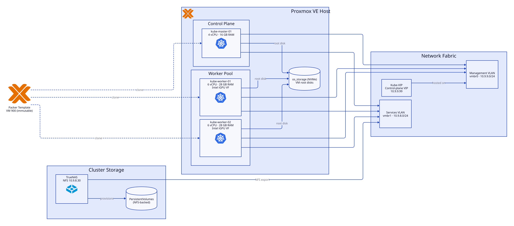
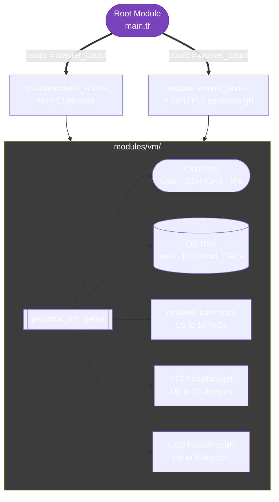
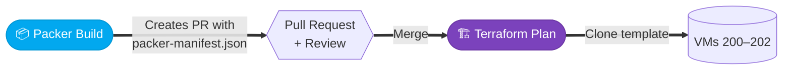
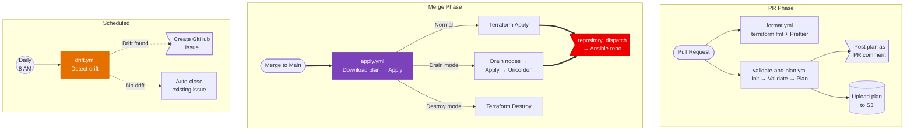

<div align="center">

# 🏗️ Terraform — Cluster Provisioning

**Declarative Proxmox VM provisioning for a K3s Kubernetes cluster**

[](https://www.terraform.io/)
[](https://www.proxmox.com/)
[](#)

*Transforms Packer-built golden images into a fully networked, GPU-enabled Kubernetes cluster*

</div>

---

## Table of Contents

- [Overview](#overview)
- [Cluster Architecture](#cluster-architecture)
- [Network Design](#network-design)
- [VM Module](#vm-module)
- [Packer Integration](#packer-integration)
- [State Management](#state-management)
- [CI/CD Automation](#cicd-automation)
- [Prerequisites](#prerequisites)
- [Usage](#usage)
- [License \& Contributing](#license--contributing)

---

## Overview

This repository provisions the compute layer of a Kubernetes homelab — cloning Packer-built Debian templates into statically-addressed, GPU-enabled VMs on Proxmox VE. It manages:

- **Master and worker node pools** with independent sizing
- **Dual-NIC networking** across management and services VLANs
- **Intel GPU passthrough** via PCI device mappings on worker nodes
- **Cloud-init injection** for SSH keys, static IPs, and DNS configuration

The template name is driven by `packer-manifest.json`, which is automatically updated via PR from the Packer build pipeline — creating a seamless image-to-cluster flow.

---

## Cluster Architecture

<picture>
  <source media="(prefers-color-scheme: dark)" srcset="docs/diagrams/cluster-architecture-dark.png">
  
</picture>

All VMs are cloned from the same immutable Packer template, then individualized via cloud-init (hostname, static IPs, SSH keys). Worker nodes additionally receive **Intel iGPU virtual functions** via PCI passthrough for hardware-accelerated transcoding and ML workloads.

---

## Network Design

Every node is dual-homed across two isolated networks:

| Network | Bridge | CIDR | Gateway | Purpose |
|---------|--------|------|---------|---------|
| **Management** | `vmbr0` | `10.9.9.0/24` | — | SSH, Kubernetes API, Kube-VIP HA |
| **Services** | `vmbr1` | `10.9.8.0/24` | `10.9.8.1` | Default Internet egress, Pod overlay (Flannel), NFS, LoadBalancer traffic |

IP addresses are computed deterministically from a base CIDR and offset:

| Node | Management IP | Services IP | VM ID |
|------|--------------|-------------|-------|
| kube-master-01 | `10.9.9.50` | `10.9.8.50` | 200 |
| kube-worker-01 | `10.9.9.51` | `10.9.8.51` | 201 |
| kube-worker-02 | `10.9.9.52` | `10.9.8.52` | 202 |

> IPs are calculated as `base_cidr + start_offset + node_index`, ensuring masters and workers form a contiguous block.

---

## VM Module

A reusable Terraform module (`modules/vm/`) encapsulates all VM provisioning logic:


```mermaid
flowchart TB
    ROOT(["Root Module\nmain.tf"])

    ROOT ==>|"count = master_count"| MASTER["module.master_nodes\nNo PCI devices"]
    ROOT ==>|"count = worker_count"| WORKER["module.worker_nodes\n+ GPU PCI passthrough"]

    subgraph mod["modules/vm/"]
        VM[[proxmox_vm_qemu]]
        VM --> CI([Cloud-Init\nUser · SSH Keys · IPs])
        VM --> DISK[(OS Disk\nvirtio · IOThread · TRIM)]
        VM --> NET["Network Interfaces\nUp to 16 NICs"]
        VM --> PCI["PCI Passthrough\nUp to 15 devices"]
        VM --> USB["USB Passthrough\nUp to 5 devices"]
    end

    MASTER --> mod
    WORKER --> mod

    classDef root fill:#7B42BC,stroke:#6A35A3,color:#fff
    style mod fill:#3C3C3C,color:#fff
    class ROOT root
```

The module supports:

| Feature | Details |
|---------|---------|
| **Multi-NIC** | Dynamic network interface generation (up to 16) with per-NIC IP config |
| **PCI Passthrough** | GPU, network cards, or any PCI device via Proxmox resource mappings |
| **USB Passthrough** | Direct USB device access for IoT/serial hardware |
| **Cloud-Init** | User provisioning, SSH keys, static IP assignment, DNS config |
| **Storage** | Virtio disks with IOThread, TRIM/discard, configurable pools |
| **Tagging** | Proxmox tags for Ansible dynamic inventory discovery |

---

## Packer Integration

The `packer-manifest.json` file is the bridge between the Packer and Terraform repos:

```json
{
  "builds": [{
    "custom_data": {
      "vm_name": "packer-debian-13.4.0-...",
      "git_tag": "v13.4.0...",
      "i915_sriov_version": "..."
    }
  }]
}
```

This file is **automatically updated via PR** from the Packer build workflow. The `vm_name` field becomes the `base_vm_name` variable — the template that Terraform clones for all cluster nodes.


```mermaid
flowchart LR
    PK(["📦 Packer Build"]) ==>|"Creates PR with\npacker-manifest.json"| PR{{"Pull Request\n+ Review"}}
    PR ==>|Merge| TF(["🏗️ Terraform Plan"])
    TF ==>|"Clone template"| VMs[(VMs 200–202)]

    classDef packer fill:#02A8EF,stroke:#0196D4,color:#fff
    classDef terraform fill:#7B42BC,stroke:#6A35A3,color:#fff
    class PK packer
    class TF terraform
```

---

## State Management

Terraform state is stored in an **S3-compatible backend**, keeping state off local machines and enabling CI-driven workflows:

| Setting | Value |
|---------|-------|
| **Backend** | S3-compatible (path-style) |
| **Bucket** | `terraform-state` |
| **Key** | `terraform.tfstate` |
| **Locking** | Implicit via CI (single runner) |

---

## CI/CD Automation

Four workflows manage the full infrastructure lifecycle:


```mermaid
flowchart TD
    subgraph pr["PR Phase"]
        PR([Pull Request]) --> FMT[format.yml\nterraform fmt + Prettier]
        PR --> VP[validate-and-plan.yml\nInit → Validate → Plan]
        VP --> CMT>Post plan as\nPR comment]
        VP --> S3[(Upload plan\nto S3)]
    end

    subgraph merge["Merge Phase"]
        MERGE([Merge to Main]) ==> APP[apply.yml\nDownload plan → Apply]
        APP -->|Normal| APPLY[Terraform Apply]
        APP -->|Drain mode| DRAIN[Drain nodes →\nApply → Uncordon]
        APP -->|Destroy mode| DESTROY[Terraform Destroy]
        APPLY & DRAIN ==> DISPATCH>repository_dispatch\n→ Ansible repo]
    end

    subgraph sched["Scheduled"]
        DAILY((Daily\n8 AM)) --> DRIFT[drift.yml\nDetect drift]
        DRIFT -.->|Drift found| ISSUE>Create GitHub\nIssue]
        DRIFT -.->|No drift| CLOSE["Auto-close\nexisting issue"]
    end

    classDef apply fill:#7B42BC,stroke:#6A35A3,color:#fff
    classDef dispatch fill:#EE0000,stroke:#CC0000,color:#fff
    classDef drift fill:#E57000,stroke:#CC6300,color:#fff
    class APP apply
    class DISPATCH dispatch
    class DRIFT drift
```

| Workflow | Trigger | Purpose |
|----------|---------|---------|
| **validate-and-plan** | PR | Terraform init/validate/plan with PR comment preview |
| **format** | PR | Enforces `terraform fmt` and Prettier formatting |
| **apply** | Merge to main | Applies plan with optional drain/destroy modes via PR checkboxes |
| **drift** | Daily at 08:00 UTC | Detects infrastructure drift, creates/closes GitHub issues |

### Operational Modes

The apply workflow supports three mutually exclusive modes, controlled via checkboxes in the PR template:

| Mode | Behavior |
|------|----------|
| **Normal** | Standard `terraform apply` |
| **Drain** | Cordon + drain cluster nodes → apply → Ansible installs k3s → readiness + uncordon → bootstrap |
| **Destroy** | Full `terraform destroy` (requires explicit checkbox confirmation) |

After a successful apply, the workflow **triggers the Ansible repo** via `repository_dispatch`, continuing the pipeline.

---

## Prerequisites

- **Proxmox VE** with API token access
- **S3-compatible storage** for Terraform state (e.g., MinIO)
- **Packer template** built and available on the Proxmox node
- **Terraform** ≥ 1.5.0
- **telmate/proxmox** provider

---

## Usage

```bash
# Initialize providers and backend
terraform init

# Preview changes
terraform plan

# Apply infrastructure
terraform apply
```

> In practice, all operations run via CI. The `validate-and-plan` workflow posts a plan preview on every PR, and `apply` runs automatically on merge.

---

## License & Contributing

This is a personal homelab project. Feel free to use it as inspiration for your own infrastructure. If you spot an issue or have a suggestion, [open an issue](../../issues) — contributions and feedback are welcome.

## Storage-safe maintenance coordination

The companion Ansible maintenance PR must be merged and VM300's shared lock
bootstrap qualified before this workflow is enabled. `apply.yml` pins the same
Ansible helper used by Apps/Ansible and bind-mounts
`/var/lib/homelab-maintenance:/maintenance`. A missing runner marker blocks all
VM mutations. Normal, drain and destroy modes run under one persistent owner;
failed plan downloads cannot reach mutation. Drain and apply share a single job,
avoiding cross-job secret-output loss. Ownership is rechecked before every
infrastructure command. Successful apply releases it before Ansible dispatch
acquires its own operation. Terraform no longer waits for Kubernetes on fresh
VMs: Ansible installs k3s first, waits for inventory nodes to become Ready, then
restores scheduling before ArgoCD bootstrap. Ansible releases only on success.

Merge the companion Ansible drain-recovery receiver **before this sender**.
The `infrastructure-changed` payload carries `drained_nodes`, containing only
nodes that were schedulable before Terraform cordoned them. Ansible patches only
names still present in its current inventory; removed nodes need no recovery.
Existing intentional cordons on surviving Node objects remain held. A new Node
object after VM/cluster recreation has Kubernetes' normal scheduling defaults;
this handoff does not persist operator cordons across object deletion.
Normal/destroy operations send an empty list; old dispatches and ordinary Ansible
push/manual runs do not perform drain recovery. If dispatch fails after successful
apply/release, inspect both workflow runs and retry that failed dispatch with its
original payload; do not rerun drain/apply to reconstruct the pre-drain list.

Failure/cancellation leaves the operation record on VM300. Inspect the owning
run and exact stage, stop concurrent GUI actions, and reconcile actual VM and
writer state before explicitly releasing as the original owner. Never clear a
lock on a timer or rerun apply to take over. A lock protects participating tools;
it cannot constrain a Proxmox administrator using the GUI. Review current writer
holds and generation-retirement evidence before replacing an iSCSI worker.

Offline behavioral checks (with the pinned Ansible helper on `PYTHONPATH`):
`python3 scripts/tests/test-maintenance-workflow.py`. These use fake executables,
not live Terraform state; real cross-container locking remains a deployment gate.


### Proxmox CSI disk ownership

The shared VM module reserves SCSI disk attachments for the upstream Proxmox CSI
controller with `ignore_changes = [disks[0].scsi]`. Terraform still manages the
virtio0 boot disk and ide2 cloud-init disk. Do not add Terraform-managed SCSI
volumes to this module: their later changes would also be ignored.

This prevents an unrelated VM update from undoing a CSI attachment. It does not
protect worker-owned disks from deletion: retained CSI images must be allocated
under a separate reserved Proxmox owner ID outside this cluster's Terraform
state. The NAS export, Proxmox storage registration, CSI credentials and retained
PV/PVC bindings also have independent lifecycles. Never put that owner ID into
the disposable VM range.

The ownership rule was qualified with the pinned Telmate 3.0.2-rc10 provider in
separate disposable Debian NFS and TrueNAS 25 labs: no-op/unrelated updates,
native worker movement, PVC growth, and two complete rebuilds against each
backend preserved the retained image. This module change alone does not install
CSI, allocate storage or change an application PVC. Shared bootstrap,
old-writer exclusion and GitOps resize sequencing must be integrated before
production activation. Existing maintenance locking and PR apply modes remain
unchanged; no Velero checkpoint is introduced.


### Coordinated control-plane replacement

The accepted policy is to rebuild all three k3s VMs when the sole control-plane
VM is replaced. Worker-only replacements remain independent. In-place control-plane
CPU/memory changes do not require a worker rebuild. The ordinary Packer → Terraform
→ Ansible handoff remains the entry point; no Velero checkpoint or additional
per-rebuild confirmation is introduced.

Source preparation defaults `rebuild_workers_with_control_plane` to `false`.
Enable it only in the separately reviewed storage activation/rebuild change:
**first activation replaces both existing workers**, because their resource state
has no control-plane marker yet. Keep it enabled afterwards. Turning it off also
changes that marker and can replace workers; it is not a non-disruptive rollback.
This source PR must have a real provider plan showing no current VM changes.

When enabled, each worker stores the control-plane SMBIOS UUID in Telmate's native
`force_recreate_on_change_of` field. The pinned provider marks this field `ForceNew`.
A planned master replacement makes its UUID unknown and forces worker replacement;
a completed master recreation leaves a different UUID, so a retry still replaces
any surviving worker whose stored marker is old. Numeric VMIDs and provider resource
IDs can be reused and are not sufficient generation identities. The policy requires
exactly one master with a valid UUID; multi-master recovery needs separate design.
[Provider field](https://github.com/Telmate/terraform-provider-proxmox/blob/v3.0.2-rc10/proxmox/resource_vm_qemu.go).

The existing apply workflow dispatches Ansible only after Terraform succeeds.
Packer guests have no k3s installation, so a new master cannot bootstrap its fresh
cluster before worker replacement finishes through that workflow. Failed apply
retains maintenance ownership and skips Ansible; this change does not authorize
clearing that lock, bypassing the pipeline, using targeted production applies or
reattaching storage to an unfenced old writer. Full destroy mode keeps its existing
sequence. NAS exports, external image ownership and retained disks stay outside
this VM lifecycle.

`python3 scripts/tests/test-rebuild-cohort.py` runs real pinned-provider plans in a
temporary local backend with synthetic state, a closed loopback API endpoint, API
permission probing disabled and refresh disabled. It never applies. Initial provider
installation may need network access. The checks cover no-op and in-place changes,
master/worker/image replacement, interrupted replacement retries, inert source
defaults, first activation and missing master identity. Runtime power-off/deletion,
UUID regeneration, retained storage survival and the integrated Ansible handoff still
need disposable-lab qualification before activation. The paired drain handoff moves
readiness and uncordoning after Ansible installs k3s and before application bootstrap;
offline checks and a no-op production plan do not qualify a live replacement.

### Persistent CSI resource-pool membership

`k3s_resource_pool` defaults to `null`, preserving existing VM placement. After
separately creating and qualifying the shared CSI pool with Ansible's manual
`proxmox-csi-storage.yml`, set it to that pool's name in the reviewed activation PR.
The existing Proxmox provider then assigns both control-plane and worker VMs to
the pool during creation and keeps membership on replacement. Enrollment of
existing VMs is an in-place update in the pinned provider's offline plans.

The pool itself and CSI user/token grants are external shared infrastructure;
Terraform neither creates nor destroys them. This matters because VM-specific
ACLs disappear with VM deletion, while pool grants can cover replacement VMs.
Keep the pool limited to k3s VMs and keep the reserved image-owner ID outside
all VM/container allocations. Never add NAS storage or unrelated VMs to this pool.
The pool must exist before enrollment; a source merge with the default `null`
does not activate membership or grant CSI access. Integrated permissions and
replacement behavior still need disposable-lab qualification before activation.

The provider-plan regression suite also covers pool enrollment, stable membership
and membership after worker replacement, without API access or an apply.
