# Homelab Terraform

[](https://github.com/starktastic/homelab-terraform/actions/workflows/validate-and-plan.yml)
[](https://github.com/starktastic/homelab-terraform/actions/workflows/apply.yml)
[](https://github.com/starktastic/homelab-terraform/actions/workflows/drift.yml)


Terraform configuration for provisioning a K3s Kubernetes cluster on Proxmox VE. This project creates master and worker VMs using a Packer-built template and integrates with GitHub Actions for GitOps-style infrastructure management.

## Overview

This repository provisions the virtual machine infrastructure for the homelab Kubernetes cluster. It consumes VM templates from [homelab-packer](https://github.com/starktastic/homelab-packer) and triggers [homelab-ansible](https://github.com/starktastic/homelab-ansible) for K3s installation upon successful apply.


## Features

- 🔄 **GitOps Pipeline** - Plan on PR, review, apply on merge
- 📦 **Packer Integration** - Automatically uses latest template from manifest
- 🌐 **Dual-NIC Networking** - Management (vmbr0) and services (vmbr1) networks
- 🎮 **GPU Passthrough** - Intel SR-IOV PCI mapping for worker nodes
- 🔍 **Drift Detection** - Scheduled checks with GitHub issue creation
- 📊 **State in MinIO** - S3-compatible backend for state and plan storage
- ⚡ **Smart Triggers** - Only triggers Ansible when changes are applied

## Architecture


### Cluster Topology

| Node | Role | Cores | RAM | GPU | Management IP | Services IP |
|------|------|-------|-----|-----|---------------|-------------|
| kube-master-01 | Control Plane | 2 | 4GB | - | 10.9.9.50 | 10.9.8.50 |
| kube-worker-01 | Worker | 6 | 24GB | ✅ | 10.9.9.51 | 10.9.8.51 |
| kube-worker-02 | Worker | 6 | 24GB | ✅ | 10.9.9.52 | 10.9.8.52 |

## Repository Structure

```
homelab-terraform/
├── main.tf                 # Master and worker node definitions
├── outputs.tf              # Cluster outputs (node IPs, VM IDs)
├── providers.tf            # Terraform and Proxmox provider config
├── variables.tf            # Input variable definitions
├── terraform.tfvars        # Default variable values
├── packer-manifest.json    # Packer build manifest (auto-updated)
└── modules/
    └── vm/                 # Reusable VM module
        ├── main.tf         # VM resource definition
        ├── outputs.tf      # VM outputs
        ├── providers.tf    # Module provider requirements
        └── variables.tf    # VM input variables
```

## Prerequisites

- [Terraform](https://www.terraform.io/) >= 1.5
- [Proxmox VE](https://www.proxmox.com/) >= 8.0 with API access
- [MinIO](https://min.io/) or S3-compatible storage for state
- Packer template built via [homelab-packer](https://github.com/starktastic/homelab-packer)

## Configuration

### Variables

| Variable | Description | Default |
|----------|-------------|---------|
| `master_count` | Number of master nodes | `1` |
| `master_cores` | CPU cores per master | `2` |
| `master_memory` | RAM per master (MB) | `4096` |
| `worker_count` | Number of worker nodes | `2` |
| `worker_cores` | CPU cores per worker | `6` |
| `worker_memory` | RAM per worker (MB) | `24576` |
| `network_interfaces` | Network configuration list | See below |
| `worker_pci_mapping` | GPU PCI passthrough mapping | `k3s-worker-gpus` |

### Network Configuration

```hcl
network_interfaces = [
  {
    bridge       = "vmbr0"        # Management Network
    base_cidr    = "10.9.9.0/24"
    start_offset = 50             # First IP: 10.9.9.50
    gateway      = "10.9.9.1"     # Default gateway
  },
  {
    bridge       = "vmbr1"        # Services Network
    base_cidr    = "10.9.8.0/24"
    start_offset = 50             # First IP: 10.9.8.50
    # No gateway - internal only
  }
]
```

### Required Secrets (GitHub Actions)

| Secret | Description |
|--------|-------------|
| `MINIO_ACCESS_KEY` | MinIO access key for state storage |
| `MINIO_SECRET_KEY` | MinIO secret key |
| `MINIO_ENDPOINT` | MinIO endpoint URL |
| `MINIO_TF_PLAN_BUCKET` | Bucket for plan artifacts |
| `PM_API_URL` | Proxmox API URL |
| `PM_API_TOKEN_ID` | Proxmox API token ID |
| `PM_API_TOKEN_SECRET` | Proxmox API token secret |
| `ORG_DISPATCH_TOKEN` | GitHub PAT for Ansible dispatch |

## CI/CD Workflows


| Workflow | Trigger | Description |
|----------|---------|-------------|
| `validate-and-plan.yml` | Pull request | Validates config, creates plan, comments on PR |
| `apply.yml` | Merge to main | Downloads plan from MinIO, applies if changes detected |
| `drift.yml` | Scheduled/manual | Creates GitHub issue if infrastructure drift detected |
| `destroy.yml` | Manual only | ⚠️ Destroys all infrastructure |
| `format.yml` | Pull request | Auto-formats Terraform, YAML, JSON |

## Usage

### Local Development

```bash
# Set environment variables
export AWS_ACCESS_KEY_ID="your-minio-key"
export AWS_SECRET_ACCESS_KEY="your-minio-secret"
export AWS_ENDPOINT_URL="https://minio.local"
export PM_API_URL="https://pve:8006/api2/json"
export PM_API_TOKEN_ID="terraform@pve!token"
export PM_API_TOKEN_SECRET="your-token-secret"
export TF_VAR_ssh_pub_key="ssh-ed25519 AAAA..."

# Initialize Terraform
terraform init

# Plan changes
terraform plan

# Apply changes
terraform apply
```

### VM Module

The `modules/vm` module creates Proxmox VMs with:

- Cloud-init configuration (user, SSH keys, networking)
- Multiple network interfaces (up to 16)
- PCI passthrough support for GPUs
- Configurable disk storage

```hcl
module "worker" {
  source = "./modules/vm"

  vm_id       = 101
  name        = "kube-worker-01"
  target_node = "pve"
  clone       = "debian-cloud-v1.0.0"

  cores  = 6
  memory = 24576

  network_bridges = ["vmbr0", "vmbr1"]
  ipconfigs = [
    "ip=10.9.9.51/24,gw=10.9.9.1",
    "ip=10.9.8.51/24"
  ]

  pci_devices = [{
    mapping = "k3s-worker-gpus"
  }]

  tags = "k3s,worker"
}
```

## State Management

Terraform state is stored in MinIO with S3-compatible backend:

```hcl
backend "s3" {
  bucket = "terraform-state"
  key    = "terraform.tfstate"
  # Configured via environment variables
}
```

## Pipeline Integration

```mermaid
flowchart TD
    subgraph Pipeline["Homelab Pipeline"]
        direction TB
        Packer["📦 Packer<br/>VM Template"]
        Terraform["🏗️ Terraform<br/>VM Provisioning"]
        Ansible["⚙️ Ansible<br/>K3s Cluster"]
        Platform["🚀 Platform<br/>GitOps Apps"]
    end
    
    Packer -->|manifest.json| Terraform
    Terraform -->|dispatch| Ansible
    Ansible -->|bootstrap| Platform
    
    style Packer fill:#4299e1,stroke:#2b6cb0
    style Terraform fill:#805ad5,stroke:#553c9a
    style Ansible fill:#48bb78,stroke:#276749
    style Platform fill:#ed8936,stroke:#c05621
```



## Troubleshooting

| Issue | Solution |
|-------|----------|
| Plan fails with clone error | Verify `packer-manifest.json` has valid template name |
| Network interface not created | Check bridge exists on Proxmox node |
| GPU passthrough fails | Verify PCI mapping exists in Proxmox datacenter config |
| State lock timeout | Check MinIO connectivity, manually unlock if needed |

## Related Repositories

| Repository | Description |
|------------|-------------|
| [homelab-packer](https://github.com/starktastic/homelab-packer) | Builds VM templates |
| [homelab-ansible](https://github.com/starktastic/homelab-ansible) | K3s cluster configuration |
| [homelab-platform](https://github.com/starktastic/homelab-platform) | GitOps application definitions |

## License

MIT